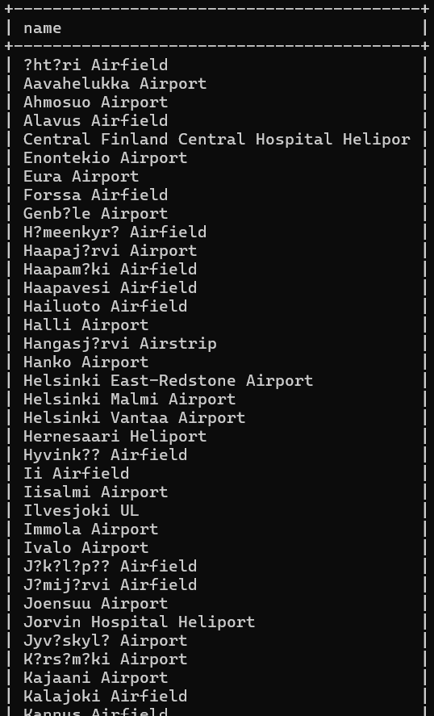

# Exercise 2

## Question 01
select * from goal;

## Question 02
select name
from airport
where iso_country = "FI";

## Question 03
select name
from airport
where iso_country = "FI"
order by name;

- Due to un-ability to take long screenshots, the above screenshot of the output is not complete.

## Question 04
select name, type
from airport
where iso_country = "FI"
order by type, name;

- Due to un-ability to take long 
screenshots, the above screenshot of the 
output is not complete.

## Question 05
select name
from country
where name like "F%";

## Question 06
select name
from country
where name like "%f%";

## Question 07
select location
from game
where screen_name = "Vesa";

## Question 08
select co2_consumed
from game
where screen_name = "Ilkka";

## Question 09
select distinct co2_budget
from game;

## Question 10
select screen_name, 
co2_budget, 
co2_consumed, 
@co2_left := co2_budget - co2_consumed as co2_left 
from game 
where screen_name = "Ilkka";

