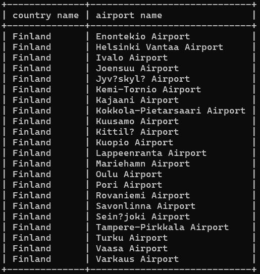
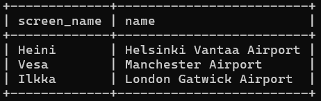
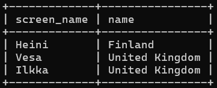
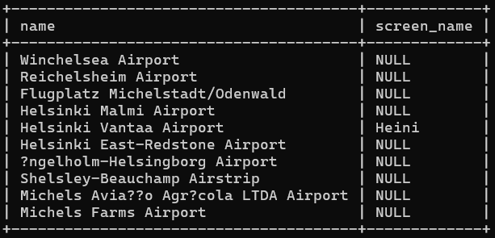
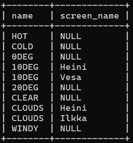

# Exercise 4

## Question 1
Select country.name as "country name", 
airport.name as "airport name" 
from country inner join airport on airport.iso_country = country.iso_country 
where country.name = "Finland"and scheduled_service = "yes";

## Question 2
select screen_name, airport.name from game inner join airport on location = ident;

## Question 3
select screen_name, country.name from game inner join airport on location = ident
inner join country on airport.iso_country = country.iso_country;

## Question 4
select airport.name, screen_name from airport left join game on ident = location where airport.name like "%Hels%";

## Question 5
select name, screen_name from goal left join goal_reached on goal.id = goal_id left join game on game.id = game_id;

